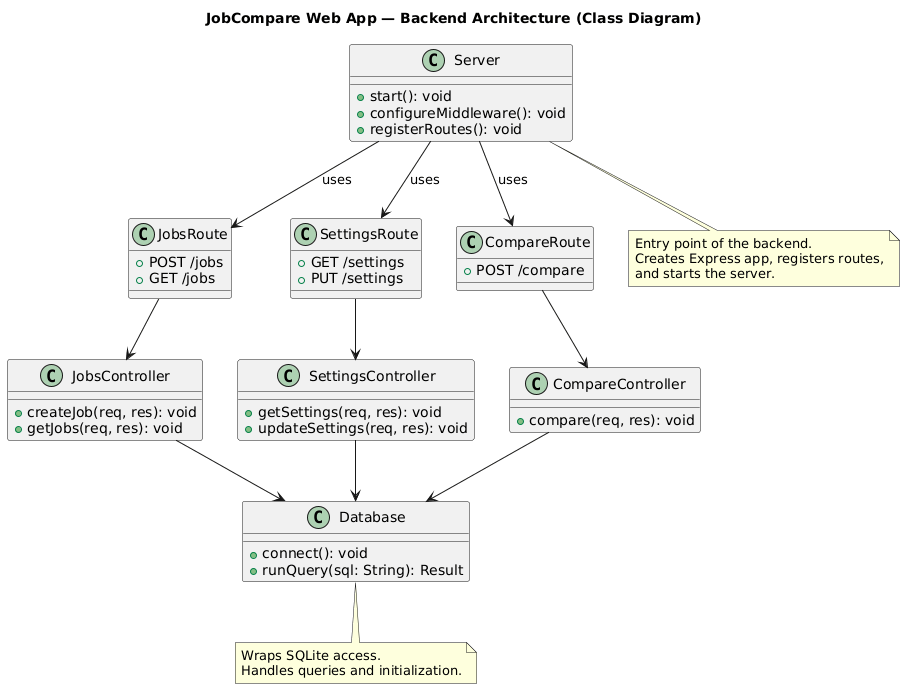
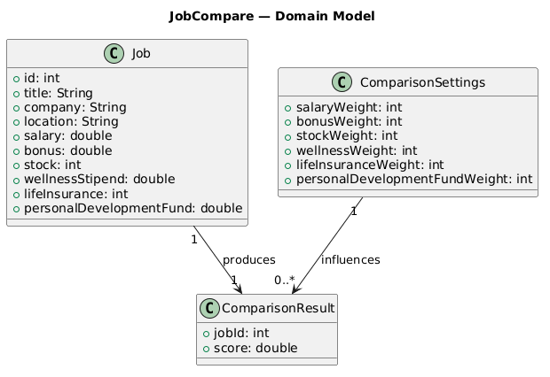

# JobCompare App

A lightweight tool for comparing job offers using customizable scoring weights. Built with **Node.js**, **Express**, and **SQLite** for fast, simple local development.

---

## 🚀 Features
- Add job offers with detailed compensation fields  
- Store and update comparison weight settings  
- Auto‑creates database tables and default settings  
- Clean REST API for CRUD operations  

---

## 🗂 Project Structure

```
backend/
  controllers/
    jobsController.js
  db/
    db.js
    init.js
    jobcompare.db
  routes/
    compare.js
    jobs.js
    settings.js
  server.js

frontend/
  (coming soon)

images/
  JobCompare_UML.png
  DataModel_Diagram.png

.gitignore
README.md
```


---

## 🧰 Tech Stack
- Node.js + Express  
- SQLite  
- Thunder Client / Postman  
- Git + GitHub  

---

## 🏗️ Architecture Diagram
    * Simplified Backend Architecture

    

    * Data Structure

    


## 📦 Setup

```bash
git clone https://github.com/seattlefurby17/jobCompareApp.git
cd jobCompareApp/backend
npm install
npm start
Server runs at: http://localhost:4000
```

## 🔌 API Endpoints
POST /jobs — create a job

GET /jobs — list jobs (coming soon)

GET /settings — get weight settings (coming soon)

PUT /settings — update settings (coming soon)

## 🗄 Database
On first run, the backend:

Creates `jobs` and `settings` tables

Inserts default comparison settings

SQLite file: `backend/db/jobcompare.db`

## 🐞 Debugging Notes (Development Learnings)
During development, I resolved two subtle backend issues:

Stale Thunder Client payload that continued sending outdated request bodies

SQLite path mismatch where the backend was reading from a different database file than intended

These helped refine my understanding of asynchronous requests, routing, and end‑to‑end debugging.

## 🛠 Workflow
`main` holds stable code

New work goes on feature branches like:

feature/backend-crud

feature/settings

feature/compare-logic

## 📌 Roadmap
Finish CRUD routes

Add scoring logic

Build frontend

Optional: auth + deployment